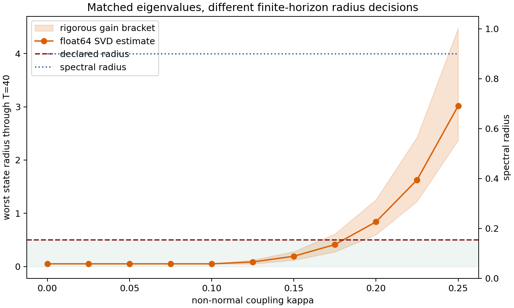

# Transient Amplification v0.1.1 — Result

## Outcome

The mathematical theorem is accepted and the deterministic synthetic
calibration passed. The application hypothesis is untested.

Every registered matrix had spectral radius `0.9`. Exact rational bounds on the
finite-horizon gain nevertheless produced three different declared-radius
decisions:

| Coupling `kappa` | Float64 `G_40` | Worst radius `0.05 G_40` | Certified decision |
|---:|---:|---:|---|
| 0.000–0.100 | 1.0000 | 0.0500 | pass |
| 0.125 | 1.7096 | 0.0855 | pass |
| 0.150 | 3.8524 | 0.1926 | pass |
| 0.175 | 8.2467 | 0.4123 | numerically indeterminate |
| 0.200 | 16.7837 | 0.8392 | fail |
| 0.225 | 32.5500 | 1.6275 | fail |
| 0.250 | 60.3540 | 3.0177 | fail |

The first certified failure is `kappa=0.20`. This is a planted, analytically
known separation: it calibrates the instrument; it is not an empirical
discovery. The value at `0.175` is intentionally left indeterminate because the
registered rational upper and lower norm bounds straddle the radius boundary.



## What was established

For a zero-input linear system, frozen positive-definite metric, and finite
integer horizon,

```text
sup_(||x0||_M<=delta) max_(0<=t<=T) ||A^t x0||_M
  = delta max_(0<=t<=T) ||M^(1/2) A^t M^(-1/2)||_2.
```

Therefore the finite-horizon singular-value gain supplies the sharp
declared-radius test. Spectral radius alone does not supply that test: it was
identical across all 11 matrices and missed all three certified crossings.

The coordinate-covariance control passed over 88 registered reframings. The
largest relative difference in gain was `9.17e-15`. This validates joint
reframing of the operator and its metric; it does not validate the choice of
metric.

That distinction is load-bearing. At `kappa=0.20`, the Euclidean metric gives a
certified failure. The registered diagonal metric has condition number
`56.1232`, converts the effective coupling to `0.15`, and gives a certified
pass. Any real application must justify its physical risk metric externally.

## Referee audit

An independent exact-rational recomputation matched every serialized fraction
and classification:

- 7 passes (`kappa=0` through `0.15`);
- 1 bound-indeterminate cell (`0.175`);
- 3 failures (`0.20`, `0.225`, `0.25`);
- exact lower gain squared at `0.20`: `142.609... > 100`; and
- exact alternative-metric upper gain: `5.60315... < 10`.

All protocol, amendment, runner, source, and artifact hashes matched the run
receipt. The repository was at committed HEAD `d9873d3` with an empty tracked
diff when the run began. Eight focused tests passed.

The referee identified two non-outcome-changing receipt-language defects:

1. the reframe manifest discloses the implemented seed schedule
   `17072027 + 1000 * coupling_index`, but the amendment froze only the base
   seed; and
2. `universal_decision_source: top_singular_vector` is imprecise. The exact
   rational bracket determines certified decisions; the singular vector
   validates the float64 gain and supplies a numerical witness.

These defects are preserved here rather than retroactively rewriting a
completed receipt.

## What was not established

- No transformer response map was measured.
- No model self-improvement or recursive process was observed.
- No norm ball was shown to be a real safety set.
- No pseudospectrum or resolvent was computed.
- The design did not match one-step operator norm, so it isolates
  spectral-radius blindness only.
- Affine forcing, stochastic disturbances, time-varying maps, and nonlinear
  rollout validity remain out of scope.

## Real-model bridge

A transformer supplies a sequence of different downstream transports, not
repeated powers of one stationary matrix. The next legitimate object is

```text
P_k = T_(l+k-1) ... T_l,
G_H = max_(0<=k<=H) ||C P_k||,
```

with `C` a frozen, named behavior or monitor output metric. Construction-split
products would be scored against held-out delayed causal effects, with
phase-scrambled singular-vector alignments and commuting normal surrogates as
matched controls. A linearization-radius check is a prerequisite. Until that
bridge succeeds, the present result is a theorem plus synthetic instrument
calibration only.

## Canonical artifacts

- `summary.json`: `ebc25c52...c83317`
- `per_coupling.csv`: `b6a1bff2...cc94f`
- `reframe_manifest.json`: `d3d9ac9d...8908e6`
- `transient_phase.png`: `9cf73cca...34c83`
- protocol: `df739432...4b37f5`
- amendment: `bb5e02e2...bded2`
